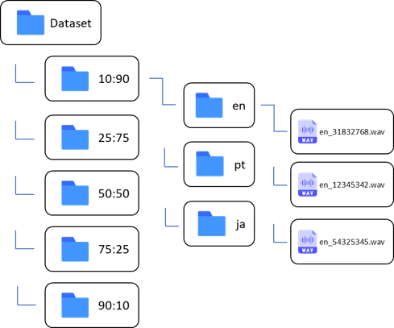

# COMM032
This is the main repository for the research development project. 

There are two main sections, the preprocessing and the pipeline, 

## Preprocessing 

There are 4 files in preprocessing that are all called in the final file named `run_all.py`.
This is a breakdown of each file and what they do. 

| Preprocessing Scripts | Usage                                                                                                                                                                  |
|-----------------------|------------------------------------------------------------------------------------------------------------------------------------------------------------------------|
| ```create_dir.py```   | Reads the names of the input dataset and creates output directories in the path provided.                                                                              |                                                                                |
| ```create_skew.py```  | Input a list of male, female speaker ratios and a max samples and this will return a dataframe and list of sample ids corresponding to that ratio for each language.   |
| ```read_tar.py```     | Extracts the designated files from the tar.gz files in the dataset zipped folder.                                                                                      |
| ```dir_flipper```     | Flips the directory so that the languages are labelled and the skews are unlabelled. It also flattens the clips folder.                                                |
| ```run_all.py```      | Runs all the functions, input a directory list and max samples and then outputs the custom datasets as .mp3 files. Also deletes those files from the original dataset. |

### Output dataset structure
From these files the output dataset structure should look like this.  




## File Conversion 
The input dataset contains .mp3 files as it is good to store compressed files. However, the model requires .wav files, therefore we will need to convert them.
In this project we have opted for using ffmpeg on the command line. 

### ffmpeg installation 
**Windows:**

1. Download the latest version of ffmpeg from the official website: https://ffmpeg.org/download.html#build-windows
2. Extract the downloaded zip file to a folder on your computer. 
3. Add the path to the `ffmpeg.exe` file to your system's PATH environment variable so that you can access it from any location in your command prompt or terminal.

**MacOS:**
1. Install Homebrew if you don't already have it. You can do this by running the following command in your terminal:
     ```
     /bin/bash -c "$(curl -fsSL https://raw.githubusercontent.com/Homebrew/install/HEAD/install.sh)"
     ```
2. Once Homebrew is installed, run the following command in your terminal to install ffmpeg:
     ```
     brew install ffmpeg
     ```

**Linux:**

1. Run the following command in your terminal to install ffmpeg:
   ```
     sudo apt-get install ffmpeg
   ```
2. This command will work for Debian-based distributions like Ubuntu. For other distributions, you can check the official ffmpeg website for installation instructions.

### ffmpeg usage guide 
**Windows:**
1. Open the Command Prompt. 
2. Navigate to the directory containing the mp3 files that you want to convert. You can do this using the cd command. 
3. You can navigate to that directory using the following command:
   
   ```bash
   cd path\to\directory\split\language\
   ```
   4. Once you're in the directory containing the mp3 files, you can use the following command to convert all of the mp3 files to .wav format:

      ```bash
      for %i in (*.mp3) do ffmpeg -i "%i" -c:a pcm_s16le -ar 44100 "%~ni.wav" && del "%i"
      ```
      ```bash
      for %i in (*) do (
          if not "%~xi" == ".wav" (
              del "%i"
          )
      )
      ```
      This command uses a for loop to iterate over all of the mp3 files in the directory, and then uses ffmpeg to convert each mp3 file to .wav format. The resulting .wav files will be saved in the same directory as the original mp3 files. It then deletes the .mp3s and any other files such as .tsv.

Wait for the command to finish executing. Depending on the number and size of the mp3 files, this may take a few minutes.
Note you need to do this for every language and split separately.

Verify that the conversion was successful by checking the directory for the newly created .wav files.

**MacOS and Linux:**
1. Open the Terminal. 
2. Navigate to the directory containing the mp3 files that you want to convert. You can do this using the cd command. For example, if your mp3 files are located in a directory called input on your desktop, you can navigate to that directory using the following command:

   ```bash
   cd ~/path/to/directory/split/language/
   ```
3. Once you're in the directory containing the mp3 files, you can use the following command to convert all of the mp3 files to .wav format:

   ```bash
   for i in *.mp3; do ffmpeg -i "$i" -c:a pcm_s16le -ar 44100 "${i%.*}.wav" && rm "$i"; done
   find . ! -name '*.wav' -type f -delete

   ```
   This command uses a for loop to iterate over all of the mp3 files in the directory, and then uses ffmpeg to convert each mp3 file to .wav format. The resulting .wav files will be saved in the same directory as the original mp3 files. Any file that isn't .wav will be deleted also.

   Again this command will take some time depending on your machine. Also verify that this has worked by checking it in your folder. Also this has to be doen for every language and split.

## Pipeline
This is a breakdown of the model pipeline infrastructure

| Model Pipeline        | Usage                                                                                                                |
|-----------------------|----------------------------------------------------------------------------------------------------------------------|
| ```model.ipynb```     | The main python notebook that runs all of the models and then stores the training histories as jsons in models_json. |                                                                                |
| ```model_vis.ipynb``` | This extracts the jsons from the model_json directory and visualises them.                                           |
| ```wav_spec_vis```    | This visualises the .wav files as audio files and spectrograms. Also allows us to listen to the clips.               |
| ```model_json```      | Folder containing all of the training and validation histories outputted by ```model.ipynb```                        |
